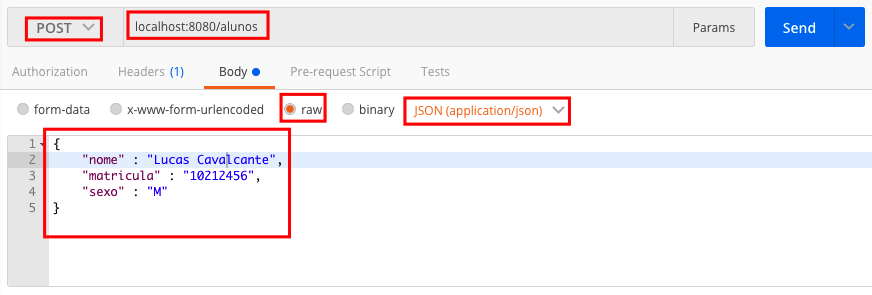
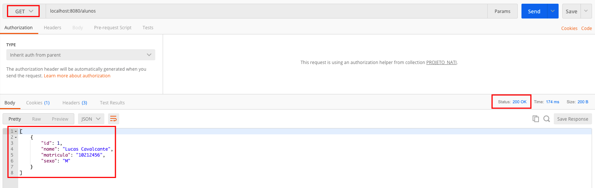

## Matrixc
Matrixc consiste em um sistema responsável por lidar com a vizualização de Matrizes Curriculares, assim como gerenciar usuários(Aluno, Professor, Coordenador e Admin), cursos, semestres e disciplinas. 

## Motivação
Motivado por um desafio de implementação, o Matrixc deverá completar esse desafio. Com isso, acarretará em um crescimento pessoal e profissional.

## Decisões de Projeto

Vamos iniciar essa sessão explicando um pouco de como o projeto chegou ao estado atual e depois aprofundar em como ele está no momento:

- Iniciou com a definição de qual banco utilizar. O MySQL foi escolhido pela praticidade e familiaridade mas também possui outras vantagens como alto desempenho, evita vazamentos de memória e uma alta segurança dos dados.
- Com a instância do MySQL rodando, muito provavelmente na porta 3306 que é a padrão, é tempo de iniciar o projeto. Não é necessário criar schemas no banco pois a JPA do Spring Boot irá criar as tabelas de acordo com o mapeamento.
- O projeto é criado utilizando o Spring Initializr. Nele podemos definir se utilizaremos Maven ou Gradle, além de definir fatores como nome do projeto, versão do JDK e outros. Foi escolhido o Maven para gerenciar o projeto e suas dependências.
- Ainda com o Spring Initializr, algumas bibliotecas foram escolhidas e adicionadas ao arquivo pom.xml. Com o avançar do desenvolvimento, ficou claro que algumas bibliotecas não seriam necessárias, ou pelo momento ou porque realmente não seriam necessárias.
- Após a criação do projeto, é necessário configurar as credenciais do banco e tais credenciais ficam no arquivo application.properties. Lá é definido se o banco será apenas atualizado quando necessário ou se toda vez que o projeto iniciar, ele vai apagar as tabelas e recriar. Assim como a url do banco, nome do usuario e senha.
- É necessário modificar os campos username e password de acordo com o que foi configurado quando o banco foi criado.
- Nesse ponto, é criado os models das diversas entidades que farão parte do sistema.
- Para cada model foram criadas um Repository, Service e Controller.
- Cada Repository extende a classe JpaRepository que torna o acesso a banco muito mais simplificado pois torna a interface disponivel via injeção de dependência e com métodos pré prontos.
- Foi optado por uma camada extra que é a Service. A Service tem o intuito de aumentar a manutenabilidade do código e separar as responsabilidades. Sem a camada de Service, os controllers possuiriam lógicas que não seriam deles.
- Essa aplicação é RESTFUL e utiliza dos verbos HTTP para o correto manuseio das informações. A camada de Controller utiliza de mapeamentos do Spring para cada situação. Por exemplo, para obter a lista de aluno é utilizado o verbo GET e a anotação é a @GetMapping.
- Foi criada a classe MatrixcExceptionHandler para lidar com erros e deixar as respostas que chegam ao front mais claras e sucintas.
- Outra decisão que aumenta a eficácia do desenvolvimento é a criação de perfis. É definido no <code>application.properties</code> qual o perfil ativo e criado o arquivo <code>application-dev.properties</code> responsável por conter as propriedades do ambiente de dev. No momento apenas o de dev foi criado mas facilmente outros poderiam ser criados, inclusive apontando para valores de produção.

- Agora algumas questões ao atual estado da aplicação:
    - A aplicação não está completa ainda. Os endpoints estão funcionais mas as visões de cada usuário ainda está por ser feita. Ainda não está ideal e ela poderá ser melhorada com a utilização do Spring Security.
    - Pode ser feito no momento requests que envolvam o CRUD de basicamente todas as entidades(Admin, Aluno, Coordenador, Curso, Disciplina, MatrizCurricular, Professor e Semestre). O Postman é uma excelente ferramenta para testar os endpoints.
    - É preciso ter conhecimento que por motivo ainda não identificado, os métodos de listarTodos e buscarCursoPorId não estão funcionais. Um bugfix será aberto com o intuito de resolver o problema.
    - Deve se atentar que da maneira como foi arquitetado, para inserir um Curso, é preciso primeiramente inserir uma MatrizCurricular.
    - Ao iniciar a aplicação a primeira vez, um erro pode ser disparado. Tal erro corresponde ao <code>org.hibernate.tool.schema.spi.CommandAcceptanceException</code> e no momento encontra-se sem solução pois uma investigação mais profunda é necessária. Um bugfix será aberto com o intuito de resolver o problema. 
 

## Tecnologias/frameworks utilizados
Foram utilizadas tecnologias atuais de maneira que seja tirado proveito dos avanços alcançados pelo stack do Spring, principalmente do Spring Boot.

<b>Desenvolvido com</b>
- [JDK 1.8](https://docs.oracle.com/javase/8/docs/api/)
- [Spring Boot 2.1.3](http://spring.io/projects/spring-boot)
- [Spring MVC 2.1.3](http://spring.io/projects/spring-boot)
- [Spring JPA 2.1.3](http://spring.io/projects/spring-data-jpa)
- [MySQL 8.0.12](https://dev.mysql.com/doc/relnotes/mysql/8.0/en/news-8-0-12.html)
- [Apache Maven 3.5.2](https://dev.mysql.com/doc/relnotes/mysql/8.0/en/news-8-0-12.html)

## Instalação
1. Instalar o MySQL e garantir que existe o usuário e senha que está configurado no <code>application.properties</code>.
2. Também garantir que está sendo executado na porta 3306. Caso esteja rodando em outra porta, é necessário atualizar a url no <code>application.properties</code>. O schema do banco e suas tabelas serão criadas automaticamente.
3. Garantir que o Java e o Maven estão instalados e acessiveis via linha de comando ou IDE.
4. Fazer o fork do projeto e em seguida baixá-lo <code>git clone https://github.com/lcdaponte/matrixc.git</code>
5. Modificar, caso necessário, as credenciais do banco no arquivo <code>application-dev.properties</code> 
6. Navegar até a raiz do projeto e executar via linha de comando, o seguinte comando: <code>mvn clean package</code>. Isso fará com que o jar da aplicação seja gerado. Ele será gerado em <code>/target/matrixc-{versãoDoJar}-SNAPSHOT.jar</code>
7. Com o jar gerado, basta executar o comando <code>java -jar matrixc-{versãoDoJar}-SNAPSHOT.jar</code> para que a aplicação seja executada.

## Como utilizar o Postman?
No momento todos os endpoints estão acessíveis via request, não há separação por perfil. A melhor ferramenta para fazer isso é o Postman. Com o Postman você pode facilmente inserir um aluno por exemplo:

Onde tem POST, você pode selecionar o verbo HTTP que pretende utilizar. Ao lado, encontra-se o endpoint que voceê pretende acessar. Abaixo encontra-se o tipo de body que será enviado, no caso application/json. O body só e necessário quando fazemos um POST ou PUT que são 2 dentre os 4 principais verbos do HTTP. Mais a abaixo, temos o body em si que no caso é o que queremos inserir. É preciso ter em mente que para inserir um aluno por exemplo, é preciso que o json esteja de acordo com a estrutura mapeada do banco de dados. Senão há a possibilidade da aplicação não conseguir deserializar o objeto. 

Em um segundo exemplo, é possível realizar um GET para obter todos os alunos. É possível identificar o status recebida pelo Postman da aplicação no quadrado vermelho do lado esquerdo. O código HTTP 200 foi retornado afirmando que foi retornardo com sucesso a lista de alunos. E na parte inferior, é possível ver a coleção de alunos que pode possuir 0 ou mais alunos.

## Exemplo do código

É possível fazer um controller de maneira bem simples:
      
      @RestController
      @RequestMapping("/alunos")
      public class AlunoController {
      
          @Autowired
          private AlunoRepository alunoRepository;
        
        
          @GetMapping
          public List<Aluno> listarTodos() {
              return alunoRepository.findAll();
          }
      }
No exemplo acima, é criado um controller com um método de listar todos os alunos que graças a anotação <code>@GetMapping</code>, o método estará disponível via GET a /alunos.

Para criar um Repository para a acesso a banco é ainda mais simples:

    import br.com.lcp.matrixc.model.Aluno;
    import org.springframework.data.jpa.repository.JpaRepository;
    
    public interface AlunoRepository extends JpaRepository<Aluno, Long> {
    }
É criada uma interface e fazemos ela estender a classe JpaRepository. Esse classe já traz diversos métodos prontos para serem utilizados e dessa maneira, basta no instanciarmos um AlunoRepository e anota-lo com <code>@Autowired</code>. Com isso o Spring tratará de injetar a instância de AlunoRepository, podendo assim, utilizar diversos métodos.

MIT © [lcdaponte](https://github.com/lcdaponte)